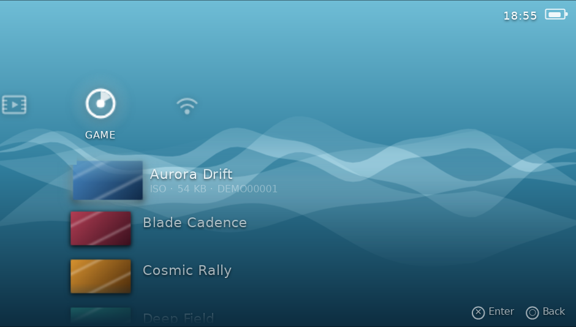
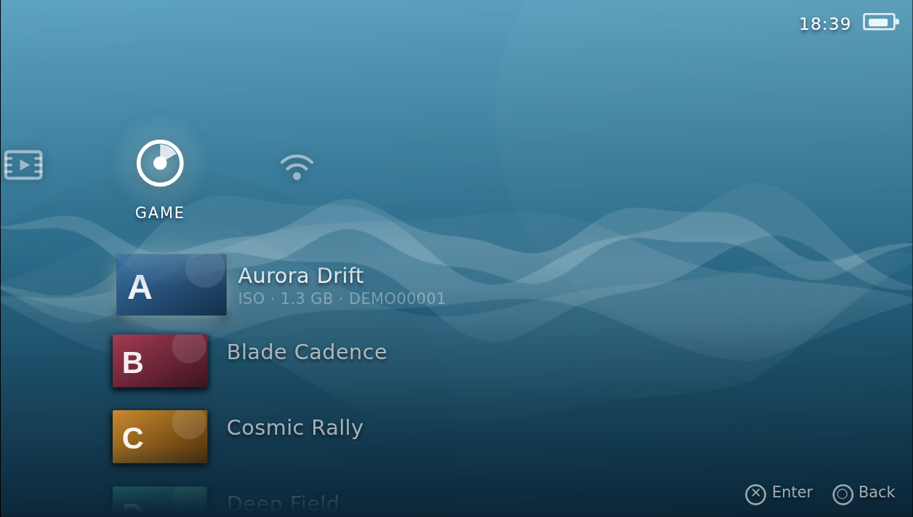
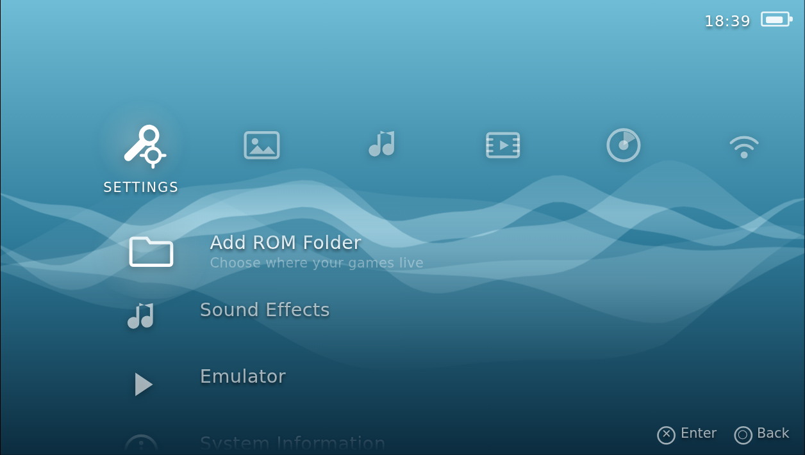
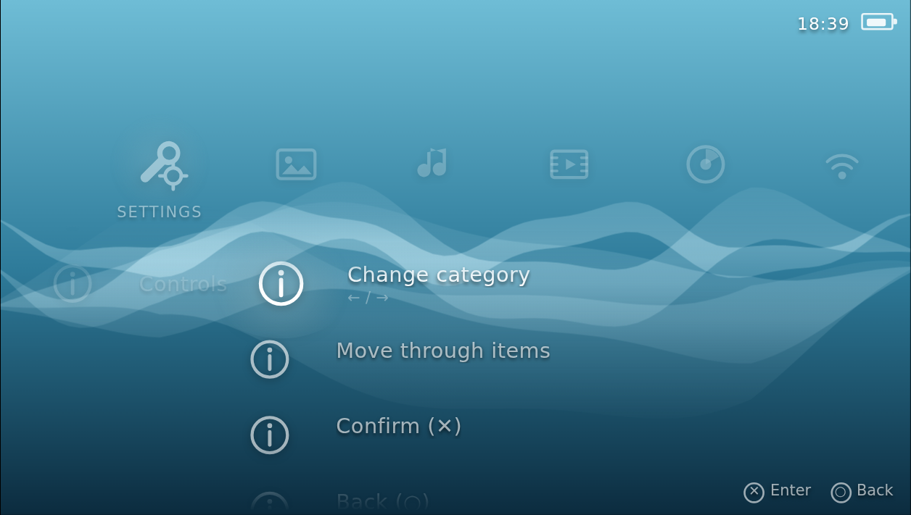
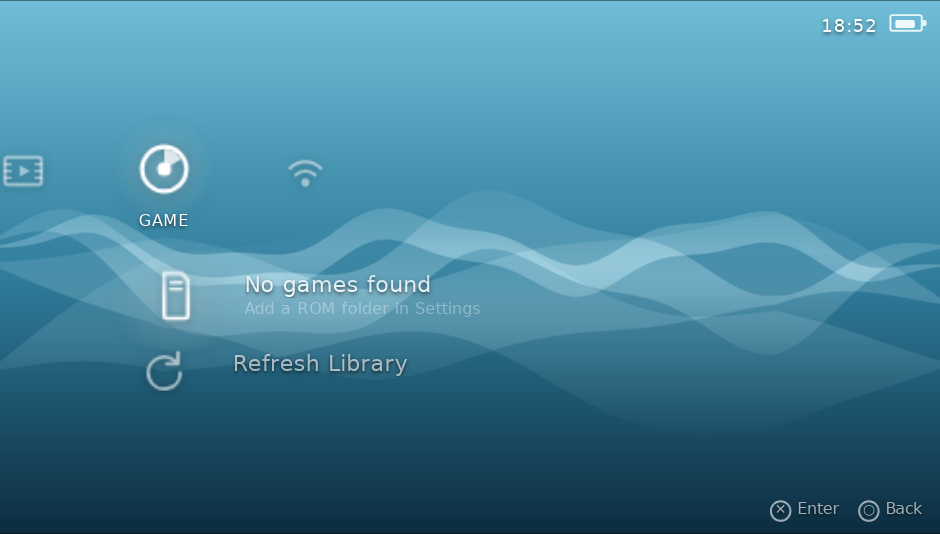
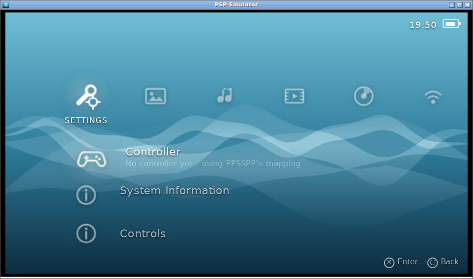

<div align="center">


# PSP-Emulator

**The PlayStation Portable's XMB, rebuilt as a desktop app — wrapped around PPSSPP.**

The sliding cross. The month-coloured wave. Your games listed with the titles and
cover art read straight out of their own ISO, CSO and PBP files. Press ✕ and
PPSSPP takes over.

[](https://github.com/ariberko/PSP-Emulator/actions/workflows/ci.yml)
[](#licence)
[](#building-it-yourself)
[](https://tauri.app)
[](docs/BASE44.md)



</div>

---

## What this is

PPSSPP is the emulator — mature, fast, and not something worth reimplementing.
What it doesn't have is the *console*: the CrossMediaBar you actually navigated,
the wave that moved behind it, the wallpaper that changed colour every month.

This is that shell. It reads your library the way a PSP reads a UMD, presents it
in the XMB, and hands off to PPSSPP when you press ✕.

|  | |
| --- | --- |
| **The actual cross** | Categories on a horizontal line, the selected category's items down a vertical one, selection where they meet — both sliding so it stays pinned. Laid out in the PSP's own 480×272 space and scaled to your window, so proportions are the console's rather than an approximation. |
| **A wave that never loops** | Summed sines at incommensurable frequencies, composited additively so ribbons bloom where they cross. |
| **Twelve months of colour** | A real PSP recolours its wallpaper by system month. All twelve are here. |
| **Real metadata, no scraping** | Titles, disc IDs and 144×80 icons parsed out of ISO9660, decompressed out of CSO, or read from a PBP section table — from each game's own `PARAM.SFO` and `ICON0.PNG`. No online database, no guessing from filenames. |
| **Console feel, pinned by tests** | No wrapping at column ends. Per-category cursor memory. Horizontal input trapped while a submenu is open. These are the details that make it read as hardware, so they're covered by tests rather than left to drift. |
| **PS5, PS4 and Xbox pads** | DualSense, DualShock 4 and Xbox controllers over USB or Bluetooth, identified by name so the hints show *that pad's* buttons — ✕/○ or A/B. Handles the awkward cases: pads reporting a non-standard mapping with Sony's raw button order, D-pads encoded as a hat axis, and deadzone hysteresis so a resting stick can't double-step. Rumble on connect and launch. |
| **Reuses PPSSPP's mapping** | Reads PPSSPP's own `controls.ini` and adopts the bindings you already set there, so a remapped ✕ works in the XMB too. Applied additively, so a config for another pad can only add buttons, never remove one. |
| **Keyboard too** | Arrow keys share one repeat model with the D-pad, so both scroll at exactly the same cadence. |

## Screenshots

<table>
<tr>
<td width="50%"><br /><sub><b>Game.</b> Cover art read from each disc image.</sub></td>
<td width="50%"><br /><sub><b>Settings.</b> The full category bar.</sub></td>
</tr>
<tr>
<td><br /><sub><b>Submenus</b> slide in; the parent column recedes.</sub></td>
<td><br /><sub><b>First run,</b> before a ROM folder is added.</sub></td>
</tr>
</table>

<sub>Captured from the running app. Titles are generated fixtures — no one's games.</sub>

## How it fits together

```
┌─ apps/shell ──────────────┐   TypeScript · Vite
│  XMB: cross layout, wave, │   Navigation is a pure state machine,
│  themes, input, audio     │   so the console's quirks are testable.
└─────────────┬─────────────┘
              │  Tauri IPC
┌─────────────┴─────────────┐
│  apps/desktop/src-tauri   │   A thin command surface. No logic —
│  7 commands, no logic     │   it needs a system webview to build,
└─────────────┬─────────────┘   which would make logic untestable.
              │
┌─────────────┴─────────────┐   ┌──────────────────────────────┐
│  crates/psp-host          │   │  crates/psp-metadata         │
│  settings · find PPSSPP · ├───┤  PARAM.SFO · PBP · ISO9660 · │
│  launch it                │   │  CSO inflate · library scan  │
└─────────────┬─────────────┘   └──────────────────────────────┘
              │  spawn, no shell
        ┌─────┴──────┐
        │   PPSSPP   │   Does the emulating.
        └────────────┘

┌─ base44/ ─────────────────┐   ┌─ site/ ──────────────────────┐
│  entities: SaveState,     │   │  Landing and download page,  │
│  LibraryEntry, Release    │   │  served by Base44 hosting.   │
│  functions: releases,     ├───┤  Reads the release manifest. │
│  save-sync                │   └──────────────────────────────┘
└───────────────────────────┘
```

Two deliberate splits are worth calling out:

**Why a separate `psp-host` crate.** The Tauri crate links against the system
webview, so anything inside it can't be built or tested on a machine without
those libraries. Everything with real behaviour therefore lives in `psp-host`,
which plain `cargo test` covers anywhere, and the Tauri layer is only a map from
IPC names onto it.

**Why one `ReadAt` trait.** A `.cso` is an `.iso` in compressed blocks. Exposing
both through one positioned-read trait means the ISO9660 walker has no idea which
it's reading, so there's a single directory-walking implementation instead of two
that drift.

## Getting started

You need **PPSSPP** installed ([ppsspp.org](https://www.ppsspp.org/)) and your own
game dumps. This ships no game data and no firmware.

1. Grab a build from the [releases page](https://github.com/ariberko/PSP-Emulator/releases), or build it yourself below.
2. Launch it, go to **Settings → Add ROM Folder**, and pick where your games live.
3. Move to **Game** and press **Enter** / **✕**.

PPSSPP is found on your `PATH` or in the standard install location for your OS;
**Settings → Emulator** reports what was found, and you can point it anywhere.

**No games yet?** Two legitimate routes. Rip a UMD you own — PPSSPP's
[dumping guide](https://www.ppsspp.org/docs/getting-started/dumping-games/) covers
what hardware you need and how — or load PSP homebrew, which its authors release
freely and which the scanner and launcher treat exactly like a retail disc. If you
only want to see the shell working, the testkit writes genuine ISO/CSO/PBP files
containing nothing copyrighted — see
[Developing without any game dumps](#developing-without-any-game-dumps).

**The builds are not code-signed.** macOS will refuse to open the app until you
right-click it and choose *Open*; Windows SmartScreen wants *More info → Run
anyway*. Signing certificates cost money this project does not have. Each release
ships `SHA256SUMS.txt` if you would rather check the file yourself.

| | Keyboard | Controller |
| --- | --- | --- |
| Change category | ← → | D-pad / left stick |
| Move through items | ↑ ↓ | D-pad / left stick |
| Confirm | Enter, Space, X | ✕ (PlayStation) / A (Xbox) |
| Back | Esc, Z | ○ (PlayStation) / B (Xbox) |

### Controllers



Connect a **DualSense**, **DualShock 4** or **Xbox** controller by USB or
Bluetooth and it just works — no mapping step. The shell identifies the pad, names
it under **Settings → Controller**, and relabels the on-screen hints with that
pad's own buttons.

- **Pairing over Bluetooth?** Some pads stay idle until they send something, so
  the browser reveals them only after the first button press. If nothing shows up,
  press a button and check **Settings → Controller** again — selecting it also
  buzzes the pad, which confirms both directions of the connection at once.
- **Already connected before launch?** Handled — pads paired ahead of time never
  fire a connect event, so they're detected at startup too.
- **Rumble** fires on connect and when a game starts, where the pad and platform
  support it.

**PPSSPP's own mapping is reused if it has one.** On startup the shell reads
PPSSPP's `PSP/SYSTEM/controls.ini` and adopts whatever you already bound there —
so if you've remapped ✕, the XMB agrees with the game instead of contradicting
it. **Settings → Controller** says when a mapping was imported and from where.

Imported bindings are applied *on top of* the built-in mapping, never instead of
it. A config written for a different pad can therefore only ever add working
buttons, not take one away.

Once PPSSPP is running it handles input itself; this shell only drives the XMB.

<br clear="right" />

Supported and identified by name: DualSense and DualSense Edge, DualShock 4 (both
revisions and the USB adapter), Xbox Series X|S, Xbox One and Xbox 360. Anything
else still works through the standard mapping — it's just labelled generically.

## Building it yourself

Needs Rust 1.94+, Node 22+, and on Linux the webview development packages.

```bash
git clone https://github.com/ariberko/PSP-Emulator
cd PSP-Emulator

# Everything that matters, no system webview needed:
cargo test                       # 82 tests across psp-metadata and psp-host
npm --prefix apps/shell ci
npm --prefix apps/shell test     # 26 navigation tests
```

Run the desktop app:

```bash
# Linux only — macOS and Windows already ship a webview.
sudo apt-get install -y libwebkit2gtk-4.1-dev libgtk-3-dev librsvg2-dev patchelf

npm --prefix apps/desktop install
npm --prefix apps/desktop run dev      # or `run build` to bundle installers
```

### Developing without any game dumps

The testkit emits genuine ISO, CSO and PBP files — valid `PARAM.SFO`, decodable
`ICON0.PNG` — so the whole pipeline can be exercised against nothing
copyrighted:

```bash
cargo run -p psp-metadata --features testkit --example make-fixtures -- /tmp/roms
```

Point a ROM folder at `/tmp/roms` and the library fills up. Every screenshot in
this README was produced this way.

## The Base44 backend

Base44 hosts the download page, the release manifest the app polls for updates,
and optional save-state sync. Game data never leaves your machine — the entities
store URLs and metadata, never payloads.

See **[docs/BASE44.md](docs/BASE44.md)** for connecting the CLI and deploying.
The short version:

```bash
npm install -g base44
base44 login                      # OAuth device-code flow, no local browser needed
base44 scaffold --app-id <app_id> # or: base44 create PSP-Emulator --path .
base44 deploy                     # entities, functions and site
```

One design note: `releases` reads under the service role, because a release
manifest is public and nothing there writes. `save-sync` runs as the *calling
user* instead, so Base44's own access rules scope rows to their owner rather than
the function re-checking ownership on every path — one missed check would
otherwise expose someone else's saves.

## Project layout

```
apps/shell/              XMB front-end (TypeScript, Vite, vitest)
apps/desktop/            Tauri v2 app + icon pipeline
crates/psp-metadata/     PSP format parsing, plus a fixture testkit
crates/psp-host/         Settings, emulator discovery, launching
base44/                  Entity and function definitions
site/                    Landing and download page
docs/BASE44.md           Base44 CLI and deployment guide
```

## Status

**Working today:** the XMB shell; library scanning across ISO, CSO, PBP and ELF;
PPSSPP discovery and launching on all three platforms; DualSense, DualShock 4 and
Xbox controllers, reusing PPSSPP's own mapping if it has one; the Photo, Music and
Video categories with a viewer and player; save-state discovery; the Base44 entity
and function definitions; the download site; and a release pipeline that builds
and publishes installers on a version tag.

**Not finished:** the desktop app does not yet *upload* save states — discovery,
hashing and change detection are done and tested, the transport is not. Nothing
has been deployed to Base44 yet either; the resources are ready and
[`docs/BASE44.md`](docs/BASE44.md) has the commands.

**Verification.** 134 Rust tests and 83 shell tests, with `clippy -D warnings`
and a Tauri compile in CI. Beyond the unit tests, the desktop app was built and
driven under Xvfb to confirm the things tests cannot: cover art extracted from
real ISO/CSO files, photos and audio playing from disk, PPSSPP's `controls.ini`
being adopted, and save states being found and counted. No physical controller was
available, so pad support is verified against synthetic gamepads rather than
hardware.

## Licence

GPL-2.0-or-later, inherited from PPSSPP.

Not affiliated with or endorsed by Sony Interactive Entertainment. "PSP" and
"PlayStation Portable" are their trademarks. Every icon, glyph and piece of
artwork here is original work in the XMB's spirit — no Sony assets are traced,
included or redistributed, and neither are the XMB's sounds, which is why the
navigation cues are synthesised from oscillators instead.
